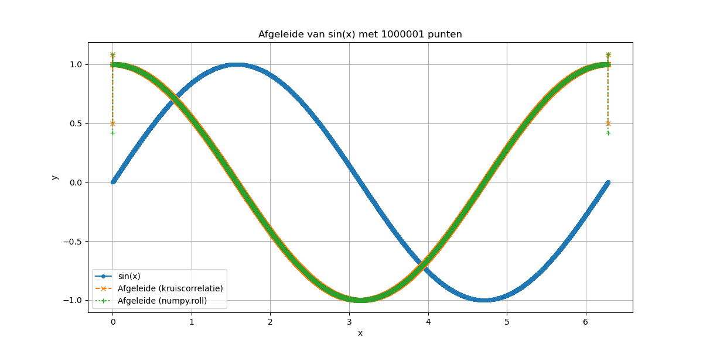

# Numerieke Differentiatie in Python



## Overzicht
Deze repository bevat Python-implementaties voor numerieke differentiatie met behulp van verschillende differentieformules. De opdrachten richten zich op het benaderen van de afgeleide en tweede afgeleide van functies, inclusief het verwerken van ruis in data.

### Opdrachten
1. **Afgeleide via 5-punts differentie**:
   - Benaderen van de eerste afgeleide van \(\sin(x)\) op het interval \([0, 2\pi]\).
   - Methodes:
     - Kruiscorrelatie (`np.convolve`).
     - Roteren van arrays (`np.roll`).
   - Onderzoek naar de nauwkeurigheid bij verschillende aantallen punten (bijv. 25, 101, 1001, 1000001).

2. **Eenvoudige differentie**:
   - Vergelijking van voorwaartse en centrale differentie om de afgeleide van \(\sin(x)\) te benaderen.
   - Gebruik van `np.diff` en `np.roll`.
   - Analyse van de verbetering bij meer datapunten.

3. **Numerieke afgeleiden met ruis**:
   - Simuleren van ruis in data en het benaderen van de eerste en tweede afgeleide van \(f(x) = x^2\).
   - Gebruik van de 5-punts centrale differentieformule.
   - Grafische weergave van de ruisimpact op de afgeleiden.

4. **Pezzack's benchmark data**:
   - Analyseren van biomechanische data (hoek en versnelling).
   - Gebruik van de 3-punts centrale differentieformule om de tweede afgeleide (versnelling) te benaderen.
   - Vergelijking met analoog gemeten versnelling.

## Bestanden
- `Afgeleide5-puntsdDfferentie.py`: Code voor het benaderen van de afgeleide van \(\sin(x)\) met de 5-punts differentieformule.
- `EenvoudigeDifferentie.py`: Python-code voor het berekenen van de eerste afgeleide van \(\sin(x)\) met verschillende methodes.

## Vereisten
- Python 3.7+
- Bibliotheken:
  - `numpy`
  - `matplotlib`

## Uitvoeren
1. Clone de repository:
   ```bash
   git clone git@github.com:ZiaadNegm/NumericalRecipes.git
   cd NumericalRecipes
2. Execute de Python files.
